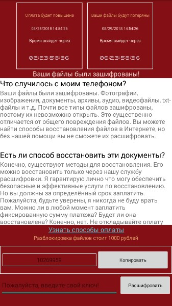

# SLocker: Android ransomware

Семейство SLocker является одним из старейших экранов блокировки мобильных телефонов и шифрования файлов, которые используются для выдачи заимствований правоохранительным органам, чтобы убедить жертв выплатить выкуп.

Смотреть больше в [Анализ Trendmicro](http://blog.trendmicro.com/trendlabs-security-intelligence/slocker-mobile-ransomware-starts-mimicking-wannacry/)

## Как внести вклад

Все вклады приветствуются, начиная от кода и заканчивая документацией, для разработки предложений по отчетам об ошибках. Пожалуйста, используйте GitHub в полной мере - вносите Pull Requests, вносите уроки или другой контент в вики - что бы вы ни предложили, мы можем использовать его!

## Отказ от ответственностм

***Заметка: SLocker предназначен для использования только в целях безопасности. Любое другое использование не является обязанностью разработчика (разработчиков). Убедитесь, что вы понимаете и соблюдаете законы в своей области. Другими словами, не будьте глупыми, не будьте мудаком и используйте его ответственно и легально.***
